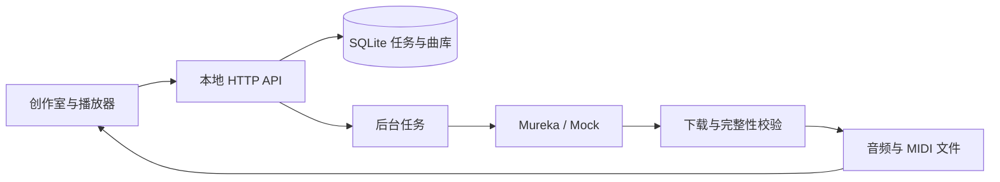

# BeatMate

### 把灵感，做成你的 Beat。

用 AI 创作 Hip-hop 伴奏，为你的说唱留出空间。写一段描述，或放进完整歌词；在同一个工作台里生成、比较、标记，再把音轨带进你的 DAW。

[](https://github.com/Wang-Zhongke/BeatMate/actions/workflows/ci.yml)
[](LICENSE)

**个人本地工作台 · Mureka 音乐生成 · 音轨与 MIDI 导出**

[听听实际作品](#两首真实作品) · [开始使用](#开始使用) · [看看工作台](#工作台) · [技术设计](#技术设计)


## 两首真实作品

从「有一点画面」到「有一段可以继续制作的声音」。以下是通过 BeatMate 保存的真实 Mureka 输出，不是 Mock 测试信号。

| 作品 | 创作方向 | 音频与制作记录 |
| --- | --- | --- |
| **半杯常温** · 3:00 | 完整中文歌词 → Jazz Hip-hop 歌曲；制作描述要求温暖、松弛、带一点深夜的自嘲 | [整曲](examples/showcase/half-cup/mix.m4a) · [伴奏](examples/showcase/half-cup/instrumental.m4a) · [人声](examples/showcase/half-cup/vocals.m4a) · [歌词与描述](examples/showcase/README.md#半杯常温) |
| **Jazz Beat** · 2:29 | 一段描述 → Jazz Hip-hop 纯伴奏；钢琴、萨克斯与复古 Boom Bap 是创作要求 | [伴奏](examples/showcase/jazz-beat/instrumental.m4a) · [制作描述](examples/showcase/jazz-beat/description.txt) |

音频链接用于下载。克隆后打开 [`examples/showcase/index.html`](examples/showcase/index.html)，可在本地连续试听四条音轨，无需 Key。文件为完整时长的 AAC 试听副本，原始 WAV 未被修改；编码方式和来源见 [案例说明](examples/showcase/README.md)。

## 为写词和制作留出空间

- **先出伴奏，再写 Rap。** 描述情绪、场景和配器，生成纯伴奏；原话直接提交，先预览再确认。
- **已有歌词，就把它做成歌。** 歌词和制作要求分别填写，生成整曲，再获取伴奏、人声和可用的 MIDI。
- **比较之后再决定。** 同位置 A/B 切换、片段循环、时间点备注，让试听结论留下来。
- **把文件带走。** 按作品打包已保存音轨、MIDI、创作内容和备注，继续在 DAW 中制作。
- **让曲库保持清楚。** 名称、搜索、收藏、分页和回收站；恢复已有任务时继续查询或下载。

当前为 **Audio MVP 0.1.0**。界面和已下载文件保存在本机，真实生成使用 Mureka API，需要联网及自己的账户；不需要本地 GPU。

## 开始使用

需要 Python 3.10+。主要面向 macOS；Ubuntu 已通过离线 CI，非 PCM 音频需要 `ffmpeg` 或 macOS 系统解码器。Windows 原生运行暂不支持。

**1. 获取项目并安装依赖**

```bash
git clone https://github.com/Wang-Zhongke/BeatMate.git
cd BeatMate
python3 -m venv .venv
.venv/bin/python -m pip install -r requirements.txt
```

**2. 先免费体验界面**

```bash
BEATMATE_AUDIO_PROVIDER=mock .venv/bin/python -m beatmate audio-serve --audio-dir output/demo --port 8767
```

打开 [localhost:8767](http://127.0.0.1:8767)。Mock 无需 Key，生成的是 4 秒测试信号，用来体验流程；想听真实效果，请看上面的作品案例。日常使用不需要 Node.js 或前端构建。

**3. 接入真实音乐生成**

首次使用时将 [`.env.example`](.env.example) 复制为 `.env`，设置：

```dotenv
BEATMATE_AUDIO_PROVIDER=mureka
BEATMATE_AUDIO_LIVE=1
MUREKA_MODEL=mureka-9
MUREKA_API_KEY=
BEATMATE_AUDIO_MAX_SUBMISSIONS=10
```

停止 Mock 服务后，macOS 执行 `./start.command`；首次会提示输入 Key，并保存在本机 `.env`，以后可直接启动。已有完整配置也可运行 `.venv/bin/python -m beatmate audio-serve --port 8767`。已有 `.env` 请直接编辑，不要覆盖。

预览不提交生成，确认后才调用真实服务。单候选歌词歌曲预留两次调用（生成 + 分离），纯伴奏预留一次；MIDI 下载不另发起分离。页面设置可保存累计额度，实际价格与余额以供应商账户为准。更多内容见 [配置与排障](docs/CONFIGURATION.md)。

## 工作台

创作区、曲库与底部播放器共处一页。完整截图可展开查看；截图来自独立 Mock 演示库，作品试听以上方真实案例为准。

<details>
<summary><strong>纯伴奏：描述、全部制作偏好与项目选择</strong></summary>


</details>

<details>
<summary><strong>歌词歌曲：完整歌词、制作要求、三轨与 MIDI</strong></summary>


</details>

## 技术设计

Python 标准库 HTTP 服务、SQLite、文件系统与原生 HTML/CSS/JavaScript。生成和分离由 Mureka 完成；BeatMate 负责创作流程、状态恢复、试听与产物管理。



- **先持久化，再提交。** 请求 ID 与内容绑定，相同请求返回原任务；结果不确定时不自动重发付费提交。
- **恢复已有结果。** 拿到供应商任务 ID 后继续查询或下载；分轨和 MIDI 分别记录状态。
- **保护原文件。** HTTPS 下载、域名和大小限制、格式与 SHA-256 校验；名称、收藏和备注独立于原始记录。
- **密钥留在后端。** 描述和歌词会发送给 Mureka，API Key 不发送到前端。默认只监听 `127.0.0.1`。

代码入口：[`audio.py`](beatmate/audio.py) 管理任务与资产，[`audio_provider.py`](beatmate/audio_provider.py) 对接服务，[`audio_http.py`](beatmate/audio_http.py) 提供接口，[`ui/`](beatmate/ui/) 实现工作台。默认曲库在 `.beatmate/audio/`，备份前应停止服务并复制整个目录。

## 当前边界

生成要求不是结果保证：纯伴奏可能残留人声，分离可能有串音。MIDI 是音符转录，不能还原 WAV 的音色、混音或完整编曲工程；供应商没有返回时就没有 MIDI。两首案例未提供正式人工质量评分。

这是个人本地工作台，没有多用户权限或公网部署方案。模型可用性、计费及生成内容的使用条件由供应商决定。

## 开发与文档

[GitHub Actions](https://github.com/Wang-Zhongke/BeatMate/actions) 覆盖 Python 3.10 / 3.12 的 macOS / Ubuntu 测试、前端模块检查与 Chromium 回归。测试使用 Mock，不调用付费生成。

- [参与开发](CONTRIBUTING.md)：安装、格式检查、自动测试与提交约束。
- [测试与验证](docs/ACCEPTANCE.md)：覆盖范围、真实案例及验证边界。
- [配置与排障](docs/CONFIGURATION.md) · [Audio API](docs/AUDIO_API.md) · [Roadmap](docs/ROADMAP.md)。
- [原生 MIDI 实验](docs/NATIVE_MIDI.md)：独立的历史规则引擎，示例归档在 [`examples/legacy-midi/`](examples/legacy-midi/README.md)。

项目代码使用 [MIT 许可证](LICENSE)。第三方依赖与素材见 [来源说明](THIRD_PARTY.md)；代码许可不授予生成音乐的额外使用权利。
