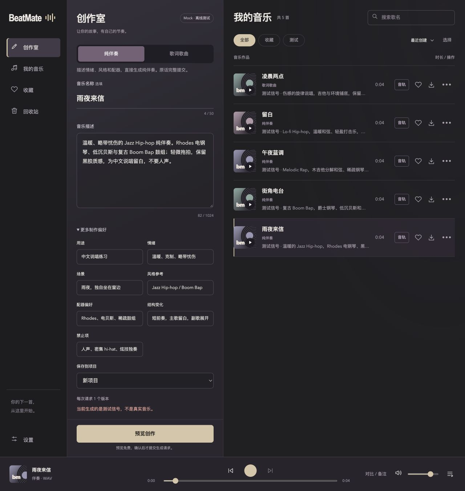
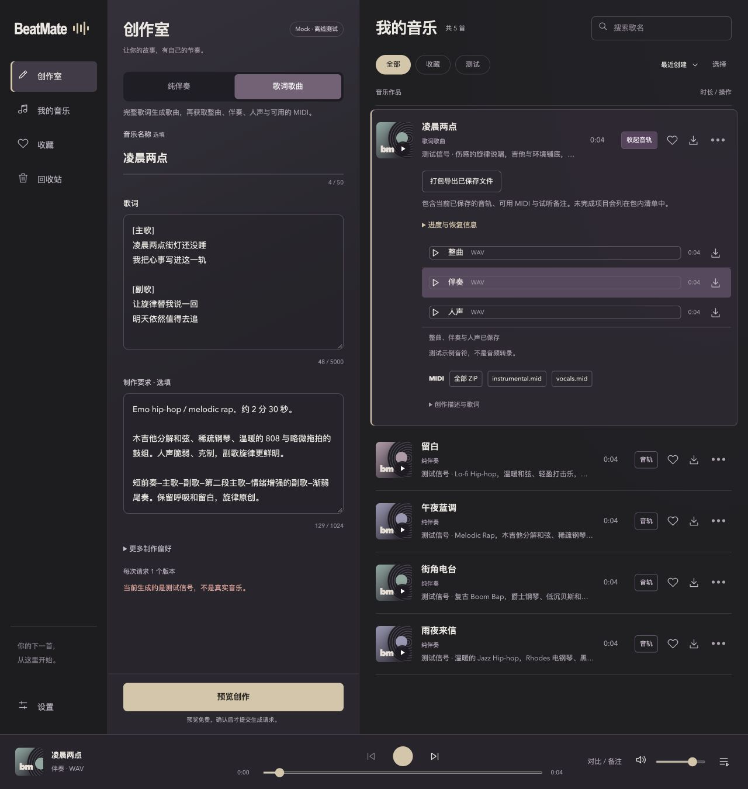
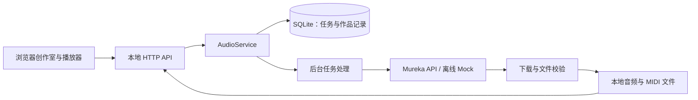

# BeatMate

**面向 Hip-hop 创作者的本地音乐工作台：把描述或歌词变成可试听、可管理、可导出的音乐。**

BeatMate 适合想先做出一版声音、再进入编曲软件继续制作的创作者。用文字生成纯伴奏，或用完整歌词生成歌曲，再获取整曲、伴奏、人声和可用的 MIDI 转录。

当前是面向个人使用的 **Audio MVP**。界面、任务记录和已下载文件保存在本机；真实音乐由 Mureka API 生成，需要联网和自己的 API Key。也提供无需 Key 的离线测试模式。


*实际入口截图：把灵感，做成你的 Beat。用 AI 创作 Hip-hop 伴奏，为你的说唱留出空间。机器人背景为 AI 生成，文字与按钮由页面渲染。*

[快速开始](#快速开始) · [使用真实音乐服务](#使用真实音乐服务) · [技术设计](#技术设计) · [当前边界](#当前边界) · [改进路线](docs/ROADMAP.md)

## 能做什么

| 你的需求 | 操作 | 获得的结果 |
| --- | --- | --- |
| 给 Rap 找一段伴奏 | 选择「纯伴奏」，描述情绪、场景、风格和配器 | 可试听、下载的伴奏候选 |
| 把歌词做成歌 | 选择「歌词歌曲」，填写完整歌词和制作要求 | 原始整曲，以及分离后的伴奏、人声 |
| 继续在 DAW 制作 | 展开作品的「音轨」 | 各音轨原文件；供应商返回时可下载 MIDI ZIP 和单个 MIDI |
| 反复试听与标记 | 播放器打开「对比 / 备注」 | 同位置 A/B 切换、片段循环、保存在音乐库中的时间点备注 |
| 整理制作文件 | 作品「音轨」中选择「打包导出已保存文件」 | 以作品名命名的 ZIP，含原文件、可用 MIDI、备注和缺失项目清单 |
| 比较与整理作品 | 搜索、收藏、重命名、排序，或「用此描述创作」 | 本地曲库与可继续修改的创作草稿 |
| 清理测试记录 | 删除作品或失败任务 | 先移入回收站，可恢复；音频作品可确认后永久删除 |

试听统一使用底部播放器。曲库每页 30 首，搜索和收藏筛选覆盖整个曲库；翻页不会打断正在播放的音轨。任务动态独立分页，批量选择和永久删除只作用于当前页。

两条创作流程都保留用户原文，不先调用文本模型改写歌词或描述。音乐名为选填项，与提交给模型的音乐描述分开保存。

## 工作台预览

纯伴奏模式：填写音乐名称和描述；展开「更多制作偏好」，补充用途、情绪、场景、风格参考、配器、结构变化和禁止项，并选择保存项目。曲库和播放器保持在同一工作台。



歌词歌曲模式：完整歌词与「制作要求」分别填写，制作要求可描述配器、演唱情绪和歌曲结构。右侧展开已完成作品，分别试听与下载整曲、伴奏、人声，以及可用的 MIDI 和打包文件。



*以上为真实页面的独立 Mock 演示库截图，使用虚构歌名与示例歌词。4 秒音频是合成测试信号，MIDI 是测试音符，用于展示流程，不代表 Mureka 的生成或分离质量。[截图来源](docs/assets/screenshots.md)*

## 快速开始

### 1. 安装

下载或克隆仓库后，在 **BeatMate 仓库根目录**执行：

```bash
python3 -m venv .venv
.venv/bin/python -m pip install -r requirements.txt
```

运行条件：

- Python **3.10+**，当前主要在 **macOS** 验证。
- 后台任务使用 Unix 文件锁；Linux 需要自行验证运行环境，Windows 原生运行暂不支持。
- PCM WAV 可直接校验；其他音频编码需要 `ffmpeg` 或 macOS 的 `afconvert`。交付下载的原始文件，不转码替换它。
- 前端为原生 HTML / CSS / JavaScript，**无需 Node.js、前端构建或本地 GPU**。

### 2. 先体验离线模式

```bash
.venv/bin/python -m beatmate audio-demo --audio-dir output/audio-demo
BEATMATE_AUDIO_PROVIDER=mock .venv/bin/python -m beatmate audio-serve --audio-dir output/audio-demo --port 8767
```

打开 **[http://127.0.0.1:8767](http://127.0.0.1:8767)**。

`audio-demo` 永远离线；第二条命令也明确使用 Mock。数据放在独立目录，不混入默认音乐库。Mock 输出的是 **4 秒合成测试信号**，用于体验生成、播放、下载和恢复流程，不代表 AI 音乐质量。生成测试歌曲后，可体验模拟分轨和 MIDI 下载。

## 使用真实音乐服务

### 1. 保存配置

首次使用且尚无 `.env` 时，把 [`.env.example`](.env.example) 复制为 `.env`。已有文件直接编辑，避免覆盖已保存的配置。将音频配置改为：

```dotenv
BEATMATE_AUDIO_PROVIDER=mureka
BEATMATE_AUDIO_LIVE=1
MUREKA_MODEL=mureka-9
MUREKA_API_KEY=
BEATMATE_AUDIO_MAX_CANDIDATES=1
BEATMATE_AUDIO_MAX_SUBMISSIONS=10
```

`mureka-9` 是配置示例，请选择自己账户已开通的模型。以上 `10` 是本地累计调用上限示例，不是供应商余额或价格。首次从模板配置歌词歌曲时，保持至少 2 次可用额度（生成与分离各预留一次）；示例上限现统一为 10，已有曲库的页面保存值不会被覆盖。当前代码接受的模型名称、输入限制和完整配置见 [配置指南](docs/CONFIGURATION.md)。

### 2. 启动

macOS 执行：

```bash
./start.command
```

首次启动会提示输入 Mureka API Key，输入不回显，并保存到本机 `.env`；之后直接启动即可。不要把真实 Key 写进 README、截图或 Git 提交。

已有完整配置时，也可直接运行：

```bash
.venv/bin/python -m beatmate audio-serve --port 8767
```

这个命令加载已有配置，但不会提示输入 Key。进程中已经设置的环境变量优先于 `.env`。音频服务默认端口统一为 8767；`./start.command --port 8770` 可指定其他端口。

启动会显示音乐库位置、配置状态、解码器与证书检查。页面 **设置 → 运行检查** 可查看版本是否需要重启；「检查服务连接」只完成 DNS/TCP/TLS 检查，不发送 HTTP 请求、不扣费，也不验证账户余额或模型权限。

### 3. 创作、试听、导出

1. 选择纯伴奏或歌词歌曲，填写音乐名（选填）和创作内容。
2. 点击 **「预览创作」**，核对最终音乐描述、歌词和调用数量。
3. 点击 **「确认生成」**后才创建生成任务；真实服务可能产生费用。
4. 在「任务动态」查看当前步骤、已确认进度和恢复动作；结果不确定的提交仍需核对供应商账户。
5. 在曲库试听；点击 **「音轨」**下载单个文件或打包导出。播放器的 **「对比 / 备注」**支持保留播放秒数切换、片段循环和时间点备注。不同版本的编排不会自动对齐。

歌曲流程会先生成完整歌曲，再为每个请求候选调用一次分离。单候选预留 **2 次调用**，双候选预留 **3 次调用**；MIDI 下载复用分离结果，不额外发起分离请求。实际收费以供应商账户为准。

在 **设置 → 调用额度**中可以保存新上限，立即生效且重启保留。保存值优先于 `.env` 的初始上限。失败或结果不确定的请求仍占本地预留额度，删除作品不会清零计数。

更新后端代码或修改 `.env` 后，需要在原终端按 `Ctrl+C`，重新启动，再刷新页面。只刷新浏览器不会更新正在运行的 Python 服务。

## 技术设计

BeatMate 使用轻量本地架构：Python 标准库 HTTP 服务、SQLite、文件系统，以及不需要构建的浏览器界面。Mido 用于 MIDI 文件处理。



几个关键设计决定：

- **先记录，再提交。** 请求 ID 与内容绑定，相同 ID 和内容返回原任务；内容改变则拒绝复用，降低重复点击或重试造成重复提交的风险。
- **区分“恢复”与“再生成”。** 已取得供应商任务 ID 时继续查询或下载；提交结果不确定时不自动重发付费请求。本地机制不能保证所有外部网络故障都不会发生重复计费。
- **作品管理与原始记录分离。** 歌名、收藏、回收站可变；原始请求和资产记录保留。永久删除清理本地文件，仍被其他作品引用的文件保留。
- **文件校验后才报告可用。** 下载使用 HTTPS、域名限制、大小限制与音频/MIDI 校验，按 SHA-256 记录文件内容。
- **本地保存不等于离线推理。** 真实生成会把描述、歌词发送至 Mureka；Key 留在后端配置中，不发送给前端。当前音频流程不需要 DeepSeek 或 OpenAI Key。

### 代码入口

| 位置 | 职责 |
| --- | --- |
| [`beatmate/audio.html`](beatmate/audio.html)、[`beatmate/ui/`](beatmate/ui/) | 创作界面、曲库、播放器和封面 |
| [`beatmate/audio.py`](beatmate/audio.py) | 任务状态、持久化、后台恢复和资产管理 |
| [`beatmate/audio_provider.py`](beatmate/audio_provider.py) | Mureka / Mock 适配与 HTTPS 传输 |
| [`beatmate/audio_stems.py`](beatmate/audio_stems.py)、[`beatmate/audio_midi.py`](beatmate/audio_midi.py) | 分轨和 MIDI 包校验 |
| [`beatmate/audio_library.py`](beatmate/audio_library.py) | 重命名、收藏、回收站与文件清理 |
| [`beatmate/audio_catalog.py`](beatmate/audio_catalog.py)、[`beatmate/ui/catalog.js`](beatmate/ui/catalog.js) | 曲库分页、变化检测与避免过期搜索结果覆盖 |
| [`beatmate/audio_health.py`](beatmate/audio_health.py)、[`beatmate/audio_progress.py`](beatmate/audio_progress.py) | 本地运行检查、连接诊断与恢复指引 |
| [`beatmate/audio_export.py`](beatmate/audio_export.py) | 持久试听备注与本地文件打包 |
| [`beatmate/audio_http.py`](beatmate/audio_http.py)、[`beatmate/audio_cli.py`](beatmate/audio_cli.py) | HTTP 和命令行入口 |
| [`tests/`](tests/) | 离线业务、故障恢复和接口测试 |

默认数据目录是 `.beatmate/audio/`：SQLite 保存任务及元数据，`assets/` 保存音频和 MIDI。更换 `--audio-dir` 就是使用另一个独立库；备份时应在停止服务后保存整个音频目录。

## 当前边界

- **这是个人本地工作台。** 默认只监听 `127.0.0.1`，没有多用户账户、权限管理或公网部署方案。
- **文字要求不是结果保证。** 时长、情绪、结构和纯伴奏要求由生成服务执行，仍需人工试听；当前没有自动 BPM / 调性检测。
- **分离可能有串音，MIDI 不等于原始编曲工程。** MIDI 是音符转录，不能还原 WAV 的音色、效果器、混音和全部演奏细节；供应商未返回时没有 MIDI 下载。
- **服务能力受账户与接口影响。** 当前只接入 Mureka 国际 API；模型权限、可用性和费用需要在自己的账户确认。
- **测试通过不等于音乐好听。** Mock 和自动测试验证工程流程；真实听感、分离质量以及 DAW 导入体验需要独立评价。

仓库还保留一条 **原生 MIDI 实验路径**：规则/Planner 生成音符、限制范围编辑、导出 MIDI 和参考 WAV。它与当前音频产品独立，也不等同于分离服务提供的 MIDI。详见 [原生 MIDI 实验说明](docs/NATIVE_MIDI.md)。

## 开发与验证

```bash
.venv/bin/python -m unittest discover -s tests -v
```

普通测试使用离线适配器或模拟响应，不调用付费服务。GitHub Actions 已配置 Python 回归、前端模块检查与独立 Mock 曲库上的浏览器回归，运行方法见 [CONTRIBUTING](CONTRIBUTING.md)。HTTP 测试需要允许监听临时本机端口。配置流水线不等于已通过远程运行，实际验证范围见 [验收记录](docs/ACCEPTANCE.md)；真实 smoke 是独立显式操作，见 [音频 CLI / API](docs/AUDIO_API.md)。

## 文档与后续方向

- [配置与排障](docs/CONFIGURATION.md)：模型、输入限制、额度、网络错误与启动问题。
- [音频 CLI / API](docs/AUDIO_API.md)：请求、任务状态、下载和显式真实验证。
- [改进路线](docs/ROADMAP.md)：按优先级梳理产品、工程和 GitHub 发布准备。
- [原生 MIDI 实验](docs/NATIVE_MIDI.md)：保留的规则生成与局部编辑能力。
- [历史音频设计](docs/AUDIO_MVP.md)：增量实现过程，部分章节描述当时状态。
- [第三方依赖与素材来源](THIRD_PARTY.md)。

项目代码采用 [MIT 许可证](LICENSE)。第三方依赖保留各自许可证，见 [第三方说明](THIRD_PARTY.md)。此代码许可不授予 Mureka 服务、模型或生成音乐的额外权利；生成内容的使用需遵守相应服务条款。
